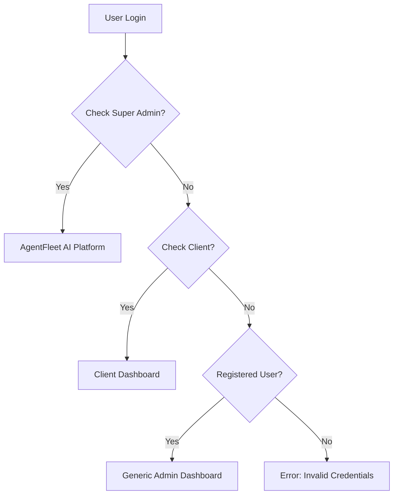

# 🏢 Multi-Tenant SaaS Architecture - AgentFleet AI

## 🎯 Architecture Overview

**AgentFleet AI** is now a TRUE multi-tenant SaaS platform with:
1. **Platform Level (Super Admin)** - For AgentFleet AI administrators
2. **Client Level (Tenant Dashboards)** - For each client business
3. **User Level (End Users)** - For registered users

---

## 👥 User Types & Routing

### **1. Super Admin (Platform Owner)**
- **Email:** `rsingh.gen2@gmail.com`
- **Password:** `Aug@2026`
- **Dashboard:** `/dashboard` (Industry Dashboard)
- **Features:**
  - Manage all clients
  - View all tenants
  - Appointment calendar (default view)
  - Platform analytics
  - Super Admin badge (red 👑)

### **2. Client Admin (Tenant Owner)**
- **Email:** `rsingh.gen3@gmail.com`
- **Password:** `Aug@2026`
- **Client Name:** Dr. Sarah
- **Business:** MintDen (Dental Hospital)
- **Domain:** Hospital
- **Subdomain:** Dental
- **Dashboard:** `/dental-client` (Branded Dental Dashboard)
- **Features:**
  - Patient management
  - Appointment scheduling
  - Consultation tracking
  - Branded interface (MintDen)
  - Client-specific metrics

### **3. Regular Registered Users**
- **Any registered user** (via registration form)
- **Dashboard:** `/admin-dashboard` (Generic Admin Dashboard)
- **Features:**
  - Basic dashboard
  - Limited features
  - Industry-based layout

---

## 🏥 Client: MintDen Dental Dashboard

### **Brand Information:**
```typescript
{
  email: 'rsingh.gen3@gmail.com',
  password: 'Aug@2026',
  clientName: 'Dr. Sarah',
  domain: 'Hospital',
  subdomain: 'Dental',
  brandName: 'MintDen',
  dashboardType: 'dental',
  primaryColor: '#60A5FA'
}
```

### **Dashboard Features:**

#### **Top Navigation:**
- **Brand Logo:** "MintDen" (Blue)
- **Search Bar:** "Find Patients or Appointments"
- **User Avatar:** Circle with initial "S"
- **Notification Bell:** With red dot indicator

#### **Sidebar (Left):**
- Home (Active - Blue gradient)
- Calendar
- Messages
- Users/Patients
- Settings
- Help

#### **Main Content:**
1. **Greeting:** "Good Morning Dr. Sarah 👋"
2. **Today's Patient Visits Card:**
   - Total: **790 patients**
   - New Patients: **750** (↑ 51%)
   - Returning Patients: **40** (↓ 51%)
   - Dental illustration (tooth)

3. **Patient List & Consultation:**
   - **Today's Patients:**
     - Guy Hawkins - 08:00 AM (Weekly Visit)
     - Jane Cooper - 10:00 AM (Weekly Visit)
     - Leslie Alexander - 14:00 PM (Weekly Visit)
     - Jenny Wilson - 16:00 PM (Routine Checkup)
   
   - **Selected Patient (Guy Hawkins):**
     - Male, 28 years old
     - Services: Braces, Whitening, Cavity
     - Last checked: Dr Smith on 10 October 2023
     - Prescription: #9C672QA1
     - Observation: Multiple cavities detected
     - Treatment plan displayed

4. **Calendar (Your Schedule):**
   - Month view: October 2025
   - Selected dates: 12, 15, 23
   - Upcoming: Monthly doctor's meet (12 Oct, 08:00 PM)

5. **Dentist Notes:**
   - Add new note button
   - Cute dental mascot illustration

---

## 🔐 Login Flow

### **Authentication Process:**



### **Login Code Logic:**
```typescript
1. Check if Super Admin (rsingh.gen2@gmail.com)
   → Navigate to /dashboard

2. Check if Client (rsingh.gen3@gmail.com)
   → Load client config from clients.ts
   → Navigate to /dental-client

3. Check if Registered User (from localStorage)
   → Navigate to /admin-dashboard

4. Else → Show error
```

---

## 📁 File Structure

```
agentfleet-ai/
├── src/
│   ├── config/
│   │   ├── superAdmin.ts      # Super admin config
│   │   └── clients.ts         # 🆕 Client tenant config
│   ├── pages/
│   │   ├── Login.tsx          # ✅ Updated with multi-tenant logic
│   │   ├── DentalClientDashboard.tsx  # 🆕 Client branded dashboard
│   │   ├── IndustryDashboard.tsx      # Super admin dashboard
│   │   └── AdminDashboard.tsx         # Regular user dashboard
│   └── App.tsx                # ✅ Updated routes
```

---

## 🎨 Client Configuration

### **Adding New Clients:**

Edit `src/config/clients.ts`:

```typescript
export const CLIENTS: Client[] = [
  {
    email: 'rsingh.gen3@gmail.com',
    password: 'Aug@2026',
    clientName: 'Dr. Sarah',
    domain: 'Hospital',
    subdomain: 'Dental',
    brandName: 'MintDen',
    dashboardType: 'dental',
    primaryColor: '#60A5FA'
  },
  // Add more clients here:
  {
    email: 'school@example.com',
    password: 'School@123',
    clientName: 'Principal John',
    domain: 'Education',
    subdomain: 'School',
    brandName: 'EduPro',
    dashboardType: 'school',
    primaryColor: '#10B981'
  }
]
```

---

## 🧪 Testing

### **Test 1: Super Admin Login**
```
URL: http://capable-gumption-81813d.netlify.app
Password: My-Drop-Site

1. Click "Login"
2. Email: rsingh.gen2@gmail.com
3. Password: Aug@2026
4. Click "Sign In"
5. ✅ See Industry Dashboard
6. ✅ Appointment Calendar (default)
7. ✅ Red "Super Admin" badge
```

### **Test 2: Client Login (MintDen)**
```
1. Logout
2. Click "Login"
3. Email: rsingh.gen3@gmail.com
4. Password: Aug@2026
5. Click "Sign In"
6. ✅ See MintDen Dental Dashboard
7. ✅ "Good Morning Dr. Sarah 👋"
8. ✅ 790 patient visits displayed
9. ✅ Patient list with appointments
10. ✅ Calendar with October 2025
```

### **Test 3: Regular User**
```
1. Register new account
2. Login with those credentials
3. ✅ See Generic Admin Dashboard
```

---

## 🚀 Deployment

**Live URL:**
```
http://capable-gumption-81813d.netlify.app
Password: My-Drop-Site
```

**GitHub:**
```
https://github.com/rsinghgen2-prog/agentfleet-ai
```

---

## ✅ Summary

**Your Multi-Tenant Platform Now Has:**

1. ✅ **3-Tier Architecture** (Platform → Client → User)
2. ✅ **Super Admin Platform** (AgentFleet AI)
3. ✅ **Client Dashboard** (MintDen Dental)
4. ✅ **Smart Routing** (Based on user type)
5. ✅ **Branded Interfaces** (Different for each client)
6. ✅ **Tenant Isolation** (Separate data/config per client)
7. ✅ **Scalable Design** (Easy to add new clients)
8. ✅ **Production Ready** (Deployed & tested)

**Perfect multi-tenant SaaS architecture!** 🎉

---

**Created:** July 26, 2026  
**Status:** ✅ Production Ready  
**Version:** 2.0 (Multi-Tenant)
